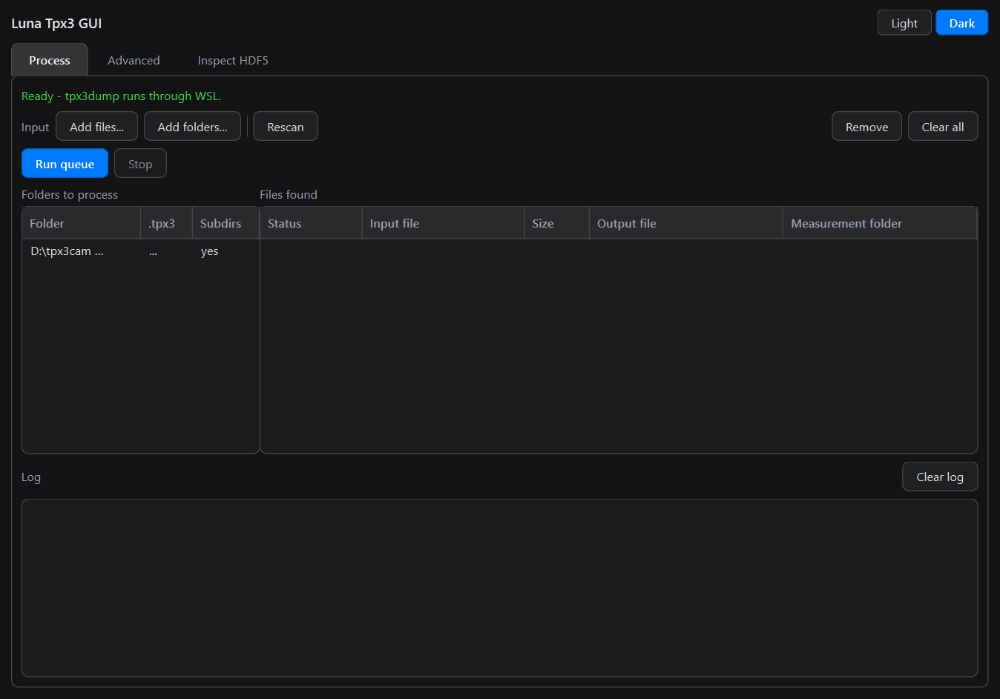
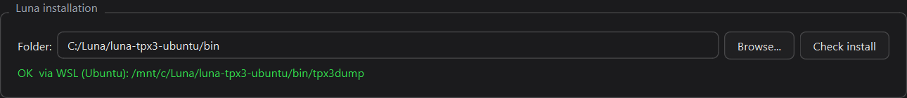
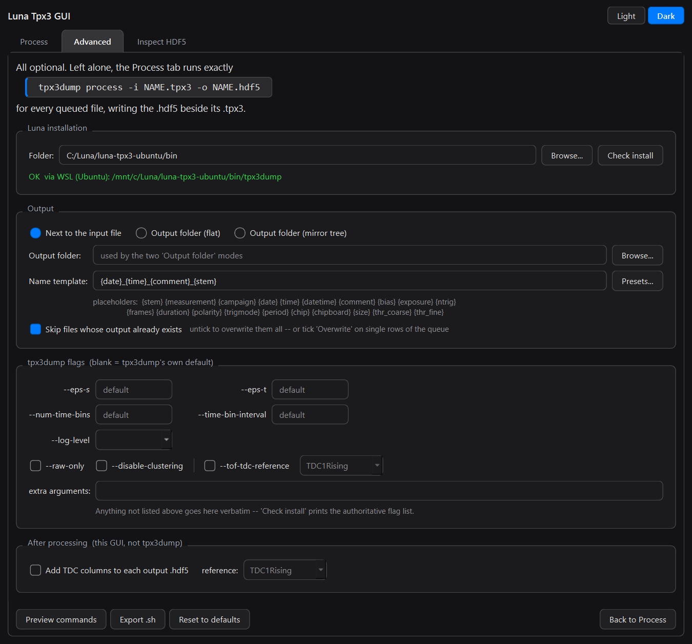
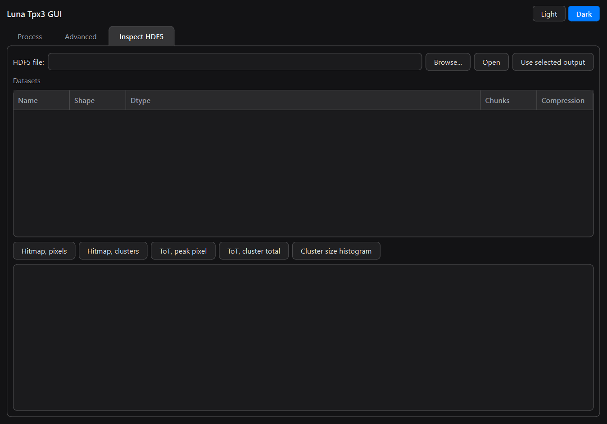
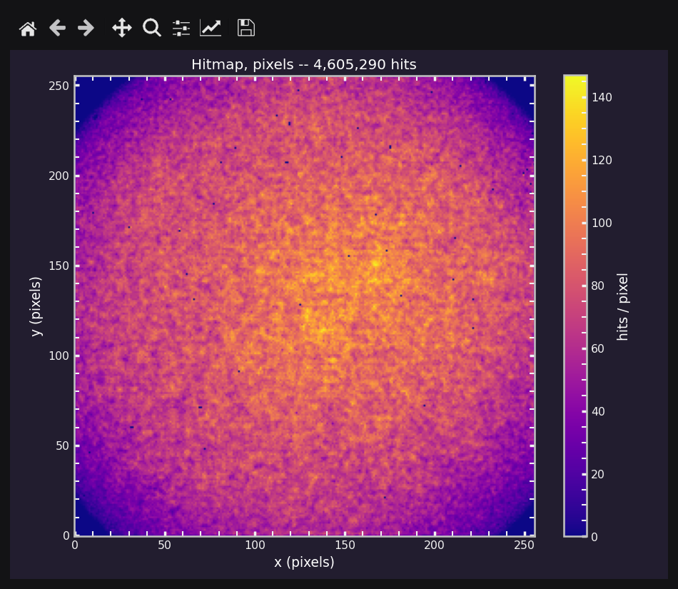
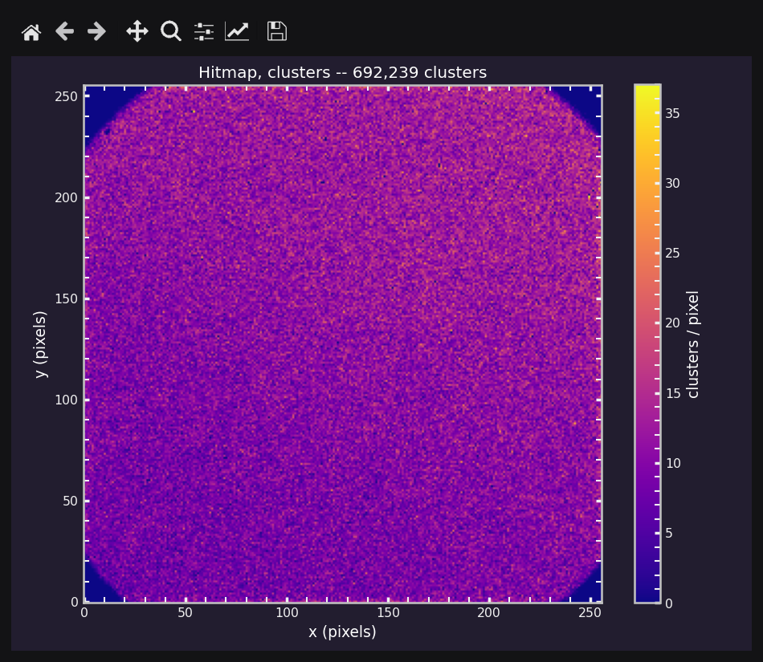
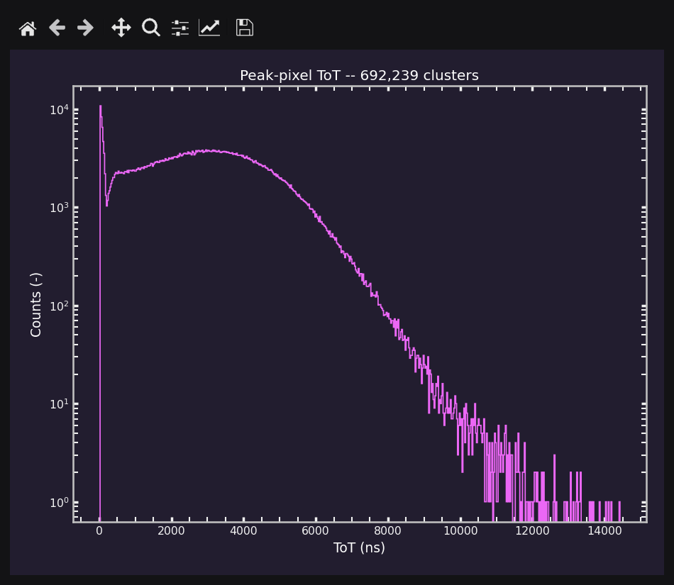
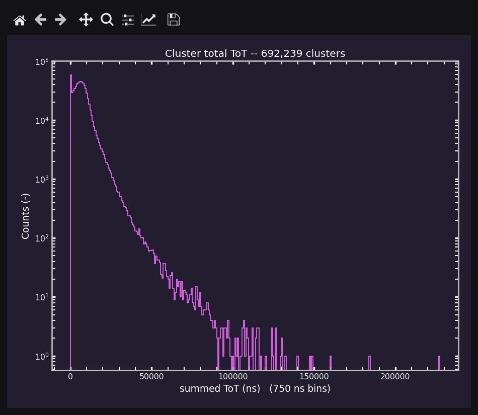
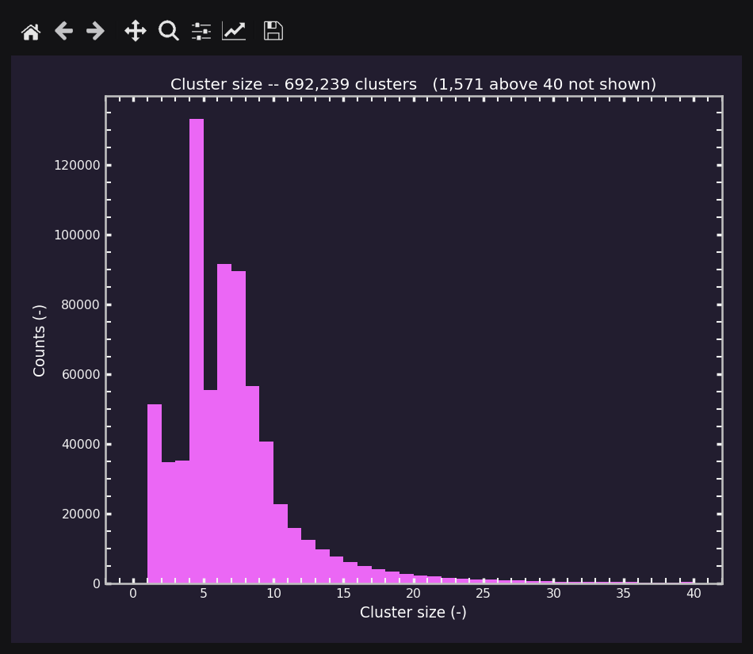

# Luna Tpx3 GUI

[](https://github.com/rngKomorebi/Luna-Tpx3-GUI/actions/workflows/tests.yml)
[](LICENSE)

A desktop front end for batch-processing Timepix3 `.tpx3` files with ASI
Luna's `tpx3dump`. Point it at one folder or twenty; it finds every `.tpx3`
underneath, names each output after the measurement it came from, and runs
`tpx3dump` over the whole lot. Without it, you type

```bash
tpx3dump process -i INPUT_NAME.tpx3 -o OUTPUT_NAME.hdf5
```

once per file, with the right paths, the right ASI filename and the
right working directory.

> **Luna is not included.** This project is only a graphical wrapper around
> ASI Luna's `tpx3dump` command-line tool. It contains no part of Luna and
> cannot convert a single `.tpx3` file by itself. You need your own licensed
> Luna installation from ASI (Amsterdam Scientific Instruments); the GUI runs
> the **unmodified** `tpx3dump` from it as a subprocess, through its documented
> command line interface. Every `.hdf5` the GUI produces is exactly what
> `tpx3dump` would have written had you typed the command yourself.

Who does what:

| Job | Done by |
|---|---|
| Decoding `.tpx3`, clustering, writing the `.hdf5` | **Luna's `tpx3dump`**: your copy, not shipped here |
| Finding the files, naming the outputs, queueing, running, logging | this GUI |
| Running the Linux-only `tpx3dump` from Windows, through WSL | this GUI |
| Reading the `.hdf5` back: summary, plots, TDC columns | this GUI (h5py; Luna is not involved) |

Built with Qt 6 (PySide6).



---

## Quick start

**Before anything else, have Luna installed** (the Ubuntu build, containing
`bin/tpx3dump`). None of the options below provides it.

| Platform | Setup | Launch |
|---|---|---|
| **Ubuntu / Linux** | `./install-linux.sh` — see [Linux](#linux) for the full five steps | Activities menu, or `./run_gui.sh` |
| **Windows** — way 1 | install WSL + Ubuntu | `run_gui.bat` from PowerShell |
| **Windows** — way 2 | `.\install-windows.ps1` | double-click the Desktop shortcut |
| **Any, as a package** | `pip install -e ".[analysis]"` | `luna-tpx3-gui` |

Windows needs WSL for **every** way — see below for why.

---

## What it can do: worked examples

Every example assumes Luna is already set up (see [First run](#first-run)).
They all use this campaign layout, which is the one ASI's acquisition software
writes: one folder per measurement, with the metadata beside a `raw/` folder
that holds the `.tpx3`.

```
D:\tpx3cam data\
  data_DCR_07.08.2026\
    Measurement_Aug_07_2026_12h52m45s\
      measurement_metadata.json
      comment.txt
      raw\
        fCqk_000000.tpx3
    Measurement_Aug_07_2026_13h10m02s\
      ...  raw\fDK5_000000.tpx3
    Measurement_Aug_07_2026_14h31m40s\
      ...  raw\gA7p_000000.tpx3
  data_TDC_08.08.2026\
    Measurement_Aug_08_2026_09h05m11s\
      ...  raw\hQ2m_000000.tpx3
```

### 1. Process a whole campaign folder

1. **Process** tab → **Add folders...** → **Browse...** →
   `D:\tpx3cam data\data_DCR_07.08.2026`.
2. Leave **Search subfolders** ticked (it is what reaches the `.tpx3` inside
   each `raw\`) → **Add to batch**.
3. **Run queue**.

The GUI walks the whole tree, queues every `.tpx3` it finds (`.TPX3` too), and
logs what it found:

```
Scanned 1 folder(s): 3 file(s) queued, 3 new
```

**Files found** lists each input with the output name it will get. The files
run one at a time, with `tpx3dump`'s own output streamed into the log. With
the default settings each `.hdf5` is written next to its `.tpx3`, named after
the measurement rather than the ASI stem:

```
Measurement_Aug_07_2026_12h52m45s\raw\
  fCqk_000000.tpx3
  2026-08-07_12-52-45_DCR-0V-gain_fCqk_000000.hdf5
```

The date, time and comment come from `measurement_metadata.json`. See
[Name templates](#name-templates) for the other fields you can use.

### 2. Many folders at once

In the same **Add folders...** dialog, click **Browse...** repeatedly, or paste
paths into the box, one per line. Explorer's *Copy as path*, quotes and all,
pastes as-is:

```
"D:\tpx3cam data\data_DCR_07.08.2026"
"D:\tpx3cam data\data_TDC_08.08.2026"
```

```
Scanned 2 folder(s): 4 file(s) queued, 4 new
```

**Folders to process** shows each folder with its `.tpx3` count. The list is
remembered between sessions, so the next time you open the GUI the batch is
already there. A folder added twice, or a file reachable through two folders,
is queued only once. **Remove** on a folder drops only the files that folder
contributed; files you picked by hand with **Add files...** stay.

### 3. Keep up with a live campaign: Rescan

A measurement that is still acquiring has no `measurement_metadata.json` yet,
so it can only be named after its ASI stem. Suppose one appears mid-campaign:

```
Scanned 2 folder(s): 5 file(s) queued, 1 new
    ...\Measurement_Aug_08_2026_09h20m00s\raw\hZ9x_000000.hdf5
```

Once it finishes, press **Rescan**. Rescan is a full refresh: it picks up new
files, drops queued rows whose input has since disappeared, and re-reads the
metadata for every row:

```
Scanned 2 folder(s): 5 file(s) queued, 1 metadata refresh(es)
    ...\Measurement_Aug_08_2026_09h20m00s\raw\2026-08-08_09-20-00_laser-405nm-TDC_hZ9x_000000.hdf5
```

Then **Run queue** again. Because **Skip files whose output already exists** is
on by default, the files you already processed are marked
`skipped - output exists` and only the new one runs. *Rescan, Run, repeat* is
the whole routine for a running campaign. Only run a measurement once it has
finished, so `tpx3dump` never reads a half-written file.

Rows that are *running* are never touched by a rescan, because their output
path is already on the `tpx3dump` command line. Rows that are *done* or
*failed* are records of something that already happened, so a rescan never
deletes them.

### 4. Collect the outputs somewhere else

By default the outputs stay beside the raw data. The **Advanced** tab →
**Output** offers two alternatives. Both need an output folder, here
`D:\processed`.

**Output folder (flat)** puts every `.hdf5` in that one folder:

```
D:\processed\
  2026-08-07_12-52-45_DCR-0V-gain_fCqk_000000.hdf5
  2026-08-07_13-10-02_DCR-0V-gain_fDK5_000000.hdf5
  2026-08-07_14-31-40_DCR-50V_gA7p_000000.hdf5
  2026-08-08_09-05-11_laser-405nm-TDC_hQ2m_000000.hdf5
```

**Output folder (mirror tree)** rebuilds the campaign structure under it,
dropping the `raw\` level, which adds nothing once the data is processed:

```
D:\processed\
  data_DCR_07.08.2026\
    Measurement_Aug_07_2026_12h52m45s\
      2026-08-07_12-52-45_DCR-0V-gain_fCqk_000000.hdf5
    ...
  data_TDC_08.08.2026\
    Measurement_Aug_08_2026_09h05m11s\
      2026-08-08_09-05-11_laser-405nm-TDC_hQ2m_000000.hdf5
```

Missing folders are created as needed. Your `.tpx3` files are never moved,
renamed or modified.

If a template makes two inputs produce the same name, both rows are marked
`CLASH` and skipped rather than one overwriting the other. With
`{date}_{comment}` in flat mode, for example, `fCqk` and `fDK5` would both
become `2026-08-07_DCR-0V-gain.hdf5`. Keep `{time}` or `{stem}` in the
template to avoid this.

### 5. The same `tpx3dump` flags for the whole batch

On **Advanced** → **tpx3dump flags**, set for example `--eps-t` to `100` and
tick `--disable-clustering`. The **Process** tab immediately shows an amber
line, so a non-default run is never a surprise:

```
Advanced: --eps-t 100, --disable-clustering
```

**Preview commands** prints the exact command line of every queued file
without running anything. On Windows it reads:

```
wsl.exe -e /mnt/c/Luna/luna-tpx3-ubuntu/bin/tpx3dump process -i '/mnt/d/tpx3cam data/data_DCR_07.08.2026/Measurement_Aug_07_2026_12h52m45s/raw/fCqk_000000.tpx3' -o '/mnt/d/tpx3cam data/data_DCR_07.08.2026/Measurement_Aug_07_2026_12h52m45s/raw/2026-08-07_12-52-45_DCR-0V-gain_fCqk_000000.hdf5' --eps-t 100 --disable-clustering
```

Any flag without its own control goes in **extra arguments**. **Check install**
prints `tpx3dump process --help`, the authoritative list for your Luna version.

### 6. Redo some files, not all

When outputs already exist, **Run queue** skips them. To redo particular
files, tick **Overwrite** on their rows in **Files found**. The checkbox in the
column header ticks or clears every row whose output exists. Untick **Skip
files whose output already exists** on the Advanced tab to overwrite
everything; the amber line then says `OVERWRITING existing output`.

### 7. Build the batch on Windows, run it on a Linux machine

For a long campaign, you may prefer to run on a Linux workstation or server.
Build the queue as usual, then **Advanced** → **Export .sh**. You get a
self-contained script with your paths translated, your flags applied, and
the input and output roots pulled out into variables to edit on the other
machine:

```bash
#!/usr/bin/env bash
# Generated by Luna Tpx3 GUI (Qt) -- run this on the Linux machine.
#
# 1. Put the Luna bin/ directory on PATH, or set TPX3DUMP below
#    to the absolute path of the tpx3dump executable.
# 2. Edit IN_ROOT / OUT_ROOT to match where the data lives there.
set -euo pipefail

TPX3DUMP=${TPX3DUMP:-tpx3dump}
IN_ROOT='/mnt/d/tpx3cam data'
OUT_ROOT=/mnt/d/processed

mkdir -p "$(dirname "$OUT_ROOT"/data_DCR_07.08.2026/Measurement_Aug_07_2026_12h52m45s/2026-08-07_12-52-45_DCR-0V-gain_fCqk_000000.hdf5)"
"$TPX3DUMP" process -i "$IN_ROOT"/data_DCR_07.08.2026/Measurement_Aug_07_2026_12h52m45s/raw/fCqk_000000.tpx3 -o "$OUT_ROOT"/data_DCR_07.08.2026/Measurement_Aug_07_2026_12h52m45s/2026-08-07_12-52-45_DCR-0V-gain_fCqk_000000.hdf5 --eps-t 100 --disable-clustering
...
```

This works even where `tpx3dump` cannot run, for example on a Windows PC
without WSL.

### 8. TDC columns on every output

**Advanced** → **After processing** → tick **Add TDC columns to each output
.hdf5** and pick the reference edge. After `tpx3dump` finishes each file, the
GUI tags every pixel hit and cluster with the TDC edge it follows, in the same
batch. The row's note then reads, for example, `412.0 MB in 38.2s, TDC
TDC1Rising (1,204,733 rows)`. See [TDC](#tdc) for what is written and how to
read it back.

---

## Requirements

```
Python 3.9+
PySide6 >= 6.5      required
h5py, numpy         optional -- Inspect tab, TDC columns
pandas              optional -- the TDC frame preview
matplotlib          optional -- the six plots
komorebi_mpl        optional -- plot styles (falls back to the app palette)
```

`pip install -r requirements.txt` covers all of it; so does
`pip install -e ".[analysis]"`, which also installs the app itself — see
[Installing from source](#installing-from-source).

---

# Linux

Follow these in order. Steps 1 and 2 are what people usually skip, and skipping
them gives you a launcher that installs cleanly and then does nothing when
clicked.

## 1. System packages

```bash
sudo apt install python3 python3-venv libxcb-cursor0 desktop-file-utils
```

- `libxcb-cursor0` — Qt 6.5+ will not open a window without it, and Qt's own
  error message (*"could not load the Qt platform plugin xcb"*) does not name
  the package. On a bare install you may also need `libxkbcommon-x11-0` and
  `libegl1`.
- `desktop-file-utils` — provides `desktop-file-validate`, which is how you
  check the menu entry in step 4. Not strictly required, but without it a
  malformed entry fails silently.

## 2. Install the launcher

From inside the GUI folder:

```bash
chmod +x run_gui.sh install-linux.sh
./install-linux.sh
```

With no flags that is the full install, which is what a fresh machine needs:

- a private venv with everything in `requirements.txt` (PySide6, h5py, numpy,
  pandas, matplotlib, komorebi_mpl), which `run_gui.sh` then finds on its own;
- the Activities-menu launcher;
- a double-clickable icon on the Desktop.

Everything lands under `$HOME`; no root, nothing system-wide.

| Flag | Effect |
|---|---|
| *(none)* | venv + menu launcher + Desktop icon |
| `--no-venv` | skip the venv (~450 MB, at `~/.local/share/luna-tpx3-gui-qt/venv`) and use the system `python3` — PySide6 must already be installed, and the script warns if it is not |
| `--no-desktop-icon` | skip the icon on the Desktop; the menu launcher is still installed |
| `--uninstall` | remove the launcher, icon and desktop shortcut. Leaves the GUI's own files and the venv alone. |

`--with-venv` and `--desktop-icon` from older instructions are still accepted;
both are now the default.

Re-running is safe; it overwrites the entry. If you move the folder, run it
again so the launcher points at the new path.

## 3. Check it runs at all

Before worrying about the menu, prove the app itself starts:

```bash
./run_gui.sh
```

If a window opens, the launcher problem is purely a menu problem. If it does
not, you are missing PySide6 or `libxcb-cursor0` — `run_gui.sh` says which, in
a dialog if it can and on stderr regardless.

`run_gui.sh` picks its interpreter in this order: `$PYTHON`, a `.venv` beside
the script, the venv `install-linux.sh` built, then the system `python3`.

## 4. Not showing up in the applications menu?

Work down this list; each step tells you something the previous one could not.

**Is the file there?**

```bash
ls -l ~/.local/share/applications/luna-tpx3-gui-qt.desktop
```

If it is missing, the installer failed — re-run it and read the output. It
reports the path it wrote and exits with an error if the write did not happen.

**Is it well-formed?**

```bash
desktop-file-validate ~/.local/share/applications/luna-tpx3-gui-qt.desktop && echo VALID
```

This is the one that finds real problems. A menu silently ignores an entry it
cannot parse, which looks identical to "the menu has not refreshed yet".

**Does the menu know about it?**

```bash
update-desktop-database ~/.local/share/applications
```

**Is `$HOME/.local/share` even on the search path?**

```bash
echo "${XDG_DATA_HOME:-$HOME/.local/share}"
echo "$XDG_DATA_DIRS"
```

The installer honours `XDG_DATA_HOME`. If yours points somewhere unusual, that
is where the entry went.

**Still nothing?** Log out and back in. GNOME normally notices a new entry
within seconds, but a stuck shell needs a fresh session — and on Wayland the
old `Alt+F2` → `r` trick is not available, so logging out is the only way.

Search for **Luna** — the entry is named *Luna Tpx3 GUI (Qt)*.

> If you are on a version of this GUI from before this section existed and the
> entry validates as broken at the `Exec=` line, that is a fixed bug: the
> folder name contains spaces, and the path has to be quoted inside the
> `.desktop` file. Re-running the current `install-linux.sh` rewrites it
> correctly.

## 5. Point it at Luna

On Linux the Luna binary runs directly — backend `native`, nothing else to set
up. Make sure it is executable:

```bash
chmod +x /path/to/luna-tpx3-.../bin/tpx3dump
```

Then in the GUI: **Advanced** tab → browse to the folder containing
`bin/tpx3dump` → **Check install**.

---

# Windows

## How it works, and why WSL

The Luna download is the Ubuntu build. Its binaries are Linux ELF executables:

```
bin/tpx3dump:  ELF 64-bit LSB executable, x86-64,
               interpreter /lib64/ld-linux-x86-64.so.2
```

Windows cannot run that. So the split is:

- **The GUI runs natively on Windows**, as a normal Python/Qt app.
- **`tpx3dump` runs inside WSL**, launched as `wsl.exe -e /mnt/c/...`, with
  Windows paths translated to `/mnt/<drive>/...` automatically.

You never open the Ubuntu shell yourself. The GUI drives it.

Without WSL the GUI still starts and everything except *running* works — build
the queue, preview the commands, **Export .sh** to run on an Ubuntu box.

## Step 1 — Python and the dependencies

```powershell
py -3 -m pip install PySide6 h5py numpy matplotlib
```

Check it:

```powershell
py -3 -c "import PySide6, h5py, numpy, matplotlib; print('ok')"
```

## Step 2 — install WSL and Ubuntu

In PowerShell (no administrator rights needed with current WSL):

```powershell
wsl --install -d Ubuntu
```

It downloads ~500 MB and then asks for a UNIX username and password. These are
new credentials for the Linux system, unrelated to your Windows account. On
older Windows builds WSL may ask for a reboot; current ones do not.

`Ubuntu` gives you the newest LTS. Luna is built for Ubuntu 20.04, which
Microsoft no longer offers, but that is fine: `tpx3dump` links only against
core glibc and libgcc —

```
libgcc_s.so.1  libpthread.so.0  libm.so.6  libdl.so.2  libc.so.6
```

— and glibc is forward-compatible, so a 20.04 build runs unchanged on 24.04.
**No extra `apt install` is needed.** If you would rather stay close to the
build target, `wsl --install -d Ubuntu-22.04` also works.

## Step 3 — check the installation

Three checks, each answering a different question.

**Is a distribution installed and running?**

```powershell
wsl --list --verbose
```

```
  NAME      STATE      VERSION
* Ubuntu    Running    2
```

**Can WSL execute the Luna binary?** Give it the `/mnt/...` form of your own
Luna path:

```powershell
wsl -e /mnt/c/Users/<you>/path/to/luna-tpx3-.../bin/tpx3dump --version
```

```
Tpx3Dump 0.3.2
```

If that prints a version, the backend works. No `chmod +x` is needed — `/mnt/c`
is mounted with everything executable.

**Can WSL see your data?** For data on `D:`:

```powershell
wsl -e ls "/mnt/d/tpx3cam data"
```

WSL auto-mounts **fixed** disks only. A USB stick, card reader or other
removable drive never appears under `/mnt`, so `tpx3dump` cannot open anything
stored on it -- it logs `Skipping file ... as it does not have "Tpx3" extension
and is not a directory` and then panics with `index out of bounds: the len is 0`.
The GUI checks for this before a run and offers to mount the drive for you; the
equivalent by hand, for `E:`, is

```powershell
wsl -u root -e bash -c "mkdir -p /mnt/e && mount -t drvfs E: /mnt/e"
```

No password is needed, and the mount lasts until WSL next shuts down.

**From inside the GUI:** *Advanced* tab → **Check install**. It re-detects the
backend, then runs `tpx3dump --version` and `tpx3dump process --help` and dumps
both into the log. No restart is needed after installing WSL.

A correct setup looks like this — the folder pointing at `bin/`, and a green
`OK` line naming the backend and the translated `/mnt/c/...` path:



If that line is amber or red it says why: no Luna folder set, no `tpx3dump`
under it, or no WSL distribution installed. The Process tab then reads
*"Ready - tpx3dump runs through WSL."*

## Way 1 — run it from PowerShell

```powershell
cd "C:\path\to\Luna Tpx3 GUI"
.\run_gui.bat
```

or, from anywhere, in one line:

```powershell
& "C:\path\to\Luna Tpx3 GUI\run_gui.bat"
```

The `&` is PowerShell's call operator, needed whenever the command is a quoted
string. The `.bat` prefers `%USERPROFILE%\venvs\tpx4cam\Scripts\python.exe` and
falls back to `py -3`.

It uses `python.exe` deliberately, so a startup error stays readable in the
console. Do not close that console while the GUI is running — it kills the GUI.

## Way 2 — double-click, no terminal

```powershell
.\install-windows.ps1
```

That creates a **Luna Tpx3 GUI** shortcut on your Desktop. Double-click it and
the app starts — no PowerShell, no `cd`, no console window, and WSL still gets
driven underneath exactly as before.

| Flag | Effect |
|---|---|
| *(none)* | Desktop shortcut |
| `-StartMenu` | also add it to the Start Menu, so it is searchable |
| `-Python <path>` | use a specific `pythonw.exe` instead of auto-detecting |
| `-Uninstall` | remove the shortcuts. Leaves the GUI's own files alone. |

What it does: finds an interpreter that can actually `import PySide6` (checking
matters — `pythonw.exe` has no console, so an import error would be silent),
generates `src/luna_tpx3_gui/icon/luna-tpx3-gui.ico` from the 1024×1024 PNG if it is missing, and
writes a `.lnk` pointing at `pythonw.exe`. Right-click the shortcut → *Pin to
taskbar* if you want it permanently to hand.

There is deliberately no standalone `.exe` — see the
[Licence note](#licence-note).

---

## First run

1. Open the **Advanced** tab (or press *Set up Luna…* on the Process tab) and
   browse to the folder containing `bin/tpx3dump` — either the install root or
   the `bin` folder itself works. It is remembered, so this is a one-time step.
2. **Check install** proves the backend works and prints the authoritative flag
   list for the *extra arguments* box.
3. Back on **Process**, the status line reads *Ready* and the setup button
   disappears. From then on you never need the Advanced tab again.

Everything on the Advanced tab is optional — this is what it looks like once
Luna is configured:



---

## Layout

| Tab | What it is for |
|---|---|
| **Process** | The whole everyday job: add input, press Run, watch the log. Deliberately has nothing else on it. |
| **Advanced** | Luna folder, output placement, renaming, `tpx3dump` flags, command preview, script export. All optional. |
| **Inspect HDF5** | Look inside a result — datasets, counts, ToA range, TDC edges, six plots, and the button that writes the TDC columns. See below. |

Left alone, the Process tab runs exactly

```bash
tpx3dump process -i NAME.tpx3 -o NAME.hdf5
```

per queued file, writing the `.hdf5` next to its `.tpx3`. Any deviation raises
an amber summary line on the Process tab — relocation, renaming, overwriting,
and every flag passed. Silently renamed or relocated output is the one surprise
worth never having.

Folder scanning, Rescan, output placement and the rest are walked through in
[What it can do](#what-it-can-do-worked-examples).

Theme is a Light/Dark pair of buttons in the header, remembered between runs.

## Name templates

Default is `{date}_{time}_{comment}_{stem}`, built from
`measurement_metadata.json` and `comment.txt` in the measurement folder:

```
2026-08-07_12-52-45_DCR-0V-gain_fCqk_000000.hdf5
```

The time is in there because a campaign routinely puts many measurements in one
day under the same comment — on 2026-08-07 alone, `fCqk_000000` and
`fDK5_000000` are both `DCR-0V-gain`, and without `{time}` the only thing
telling them apart is the ASI stem. `{time}` is written `12-52-45`, not
`12:52:45`, because a colon is not legal in a Windows filename.

Changing this default migrates an existing config **only** if its template is
still one this program shipped as a default. A template you chose yourself is
never overwritten.

| Placeholder | Example | Source |
|---|---|---|
| `{stem}` | `fCqk_000000` | filename |
| `{measurement}` | `Measurement_Aug_07_2026_12h52m45s` | folder |
| `{campaign}` | `data_DCR_07.08.2026` | folder |
| `{date}` `{time}` `{datetime}` | `2026-08-07`, `12-52-45` | `StartDateTime` |
| `{duration}` | `10s` | Stop − Start |
| `{comment}` | `DCR-0V-gain` | `CommentAtTimeOfMeasurement` |
| `{bias}` | `50` | `BiasVoltage` |
| `{exposure}` `{ntrig}` `{frames}` `{period}` | `0.01`, `100`, `100`, `0.1` | metadata |
| `{polarity}` `{trigmode}` | `Positive`, `AUTOTRIGSTART_TIMERSTOP` | metadata |
| `{size}` `{chip}` `{chipboard}` | `256x256`, `W0028_H11`, `2000050` | metadata |
| `{thr_coarse}` `{thr_fine}` | `6`, `246` | `DACs[]` |

Placeholders with no value drop out and the separators collapse. If two inputs
would produce the same output name, both rows are marked `CLASH` and skipped —
a rename tool that silently overwrites half your batch is worse than none.

## The six plots



All six read the HDF5 in slices, so multi-GB files do not exhaust memory, and
each opens in its own modeless window — several can be compared side by side.

| Plot | Source | Binning / scale |
|---|---|---|
| **Hitmap, pixels** | `PixelHits` `x`, `y` | counts per pixel |
| **Hitmap, clusters** | `Clusters` `cx`, `cy` | cluster centroids per pixel |
| **ToT, peak pixel** | `Clusters` `ctot` | 25 ns bins, step outline, log y |
| **ToT, cluster total** | `Clusters` `sum_tot` | ~300 bins snapped to 25 ns ticks, log y |
| **Cluster size histogram** | `Clusters` `size` | 40 bins over 0–40, linear y |
| **Time since TDC edge** | `Clusters` `ctoa` − `TDCEvents` | 200 bins over one trigger period, log y |

### ctot is the peak pixel, not the cluster total

Worth knowing before reading either ToT plot. Checked against `PixelHits` for
every one of the 692,239 clusters in the reference file, with no exceptions:

| Field | What it actually holds |
|---|---|
| `ctot` | `max(tot)` over the cluster's hits — the **peak pixel** |
| `sum_tot` | `sum(tot)` over the cluster's hits — the **total** |
| `size` | number of hits in the cluster |

The giveaway is that `ctot` saturates at 14 425 ns, exactly the single-pixel
`tot` maximum. Plotted against cluster size the two behave quite differently:

| | Pearson r | median at size 1 | median at size 40 |
|---|---|---|---|
| `ctot` | 0.775 | 100 ns | 6 775 ns |
| `sum_tot` | **0.954** | 100 ns | **43 450 ns** |

`ctot` climbs steeply to about size 9 and then flattens — beyond that, extra
charge spreads into more pixels rather than driving the central one higher, so
the peak pixel saturates. `sum_tot` stays linear the whole way, as a
deposited-charge proxy should.

Use **cluster total** for deposited charge, **peak pixel** for threshold and
gain studies where the saturation is the point.

| | |
|---|---|
|  |  |
|  |  |
|  | |

The two hitmaps answer different questions and are worth comparing: the pixel
map shows the raw illumination including cluster spread, while the cluster map
counts each event once at its centroid and so comes out visibly flatter.

The cluster size histogram is capped at 40 pixels because that is where the
distribution lives; anything above is counted and stated in the plot title
rather than dropped without saying so.

## TDC

`tpx3dump` records every TDC edge it saw in `/TDCEvents`:

| Field | |
|---|---|
| `tdc_type` | `1` `TDC1Rising`, `2` `TDC1Falling`, `3` `TDC2Rising`, `4` `TDC2Falling` |
| `trigger_count` | the trigger counter that came with the edge |
| `timestamp` | 100 fs ticks — the **same clock** as `PixelHits/toa` and `Clusters/ctoa` |

Two things about that dataset are easy to get wrong, so the GUI handles both.

**Every chip repeats the packet.** A quad carries each physical edge four times
and an octal eight, so a 40-row `/TDCEvents` in a quad file describes ten
triggers, not forty. Everything here deduplicates on `(tdc_type, timestamp)`
first — the same thing ASI's `read_tdcs.py` does. The Inspect summary reports
both numbers so the difference is never a surprise:

```
TDC            10 edge(s) (40 raw records; every chip repeats the packet)
   5 TDC1Rising, 5 TDC1Falling
   TDC1Rising   5 edges, period 100.410 us (+- 0.0 ns)
   TDC1Falling  5 edges, period 100.410 us (+- 0.3 ns)
   span         0.453 ms
```

**The timestamps share the hit clock**, which is what makes "which trigger does
this cluster belong to" a subtraction rather than a guess.

### The tdc column

**Inspect HDF5 → Add TDC columns to this file** tags every pixel hit and every
cluster with the TDC edge it follows, and writes the result back into the same
`.hdf5`. On the Advanced tab, **Add TDC columns to each output .hdf5** does it
automatically for every file the batch produces.

The columns land in two new datasets, `/PixelHitsTDC` and `/ClustersTDC`, each
row-aligned 1:1 with the dataset it describes:

| Column | |
|---|---|
| `tdc` | timestamp of the reference edge this row follows, in 100 fs ticks |
| `tdc_dt` | `toa` (or `ctoa`) − `tdc`, same ticks |
| `tdc_index` | row in the deduplicated TDC table |
| `tdc_trigger` | that edge's `trigger_count` |
| `tdc_type` | `1`–`4` as above |

Rows that arrive **before the first reference edge** have nothing to measure
from and carry `-1`, which is the sentinel `tpx3dump` itself uses in
`PixelHits/tof`.

`PixelHits`, `Clusters` and `TDCEvents` are never rewritten. An HDF5 compound
dataset has a fixed dtype, so a genuine extra field would mean recreating the
whole thing — and these files are the only copy of the measurement. Writing
beside them is additive and reversible; the GUI also stamps what it wrote and
refuses to replace a `/ClustersTDC` it did not write itself.

Cost is small: the columns are chunked and gzipped, and since `tdc` and
`tdc_trigger` are constant across a whole trigger's worth of rows they
compress well — on the ASI example file the stored columns come to 3.5 bytes
per pixel hit and 4.0 per cluster, against 23 uncompressed.

### Reading it back

**Preview frame** shows the first 40 rows of what you get. From Python, the
package is importable and the three functions take no Qt (importing
`luna_tpx3_gui` does not load PySide6 at all):

```python
import luna_tpx3_gui as g

g.read_tdcs("run.hdf5")                    # the edges, deduplicated
g.add_tdc_columns("run.hdf5", "TDC1Rising")
df = g.read_with_tdc("run.hdf5", "Clusters")
```

`read_with_tdc` returns one DataFrame — the cluster (or hit) fields plus the
TDC columns, with `tdc_type` decoded to its name and `tdc_dt_s` added in
seconds:

```
      id  size        ctoa  sum_tot  ctot   cx   cy         tdc  tdc_dt  tdc_index  tdc_trigger    tdc_type      tdc_dt_s
397  397     1  5200125000     1000  1000  147  238  5199888020  236980          0           11  TDC1Rising  2.369800e-08
398  398     1  5200218750      950   950  224  280  5199888020  330730          0           11  TDC1Rising  3.307300e-08
```

It uses the stored dataset when one is there and computes the tagging on the
fly when it is not, so it works on a file straight out of `tpx3dump`. Passing
`reference=` forces the on-the-fly path, which is how you look at a different
edge without rewriting the file.

### Reference edge

The **TDC reference** setting — the same control on both tabs — picks which
edge starts the clock, with `Any edge` tagging from the most recent edge of any
type. It is independent of `tpx3dump`'s own `--tof-tdc-reference`: that flag
makes `tpx3dump` fill `PixelHits/tof` during processing, whereas these columns
are computed afterwards and can be recomputed against a different edge whenever
you like, without reprocessing the `.tpx3`.

Where the two overlap they agree exactly. On the ASI example file, with
`--tof-tdc-reference TDC1Rising` passed and `TDC1Rising` chosen here,
`tdc_dt == tof` for all 25 762 tagged hits, and both mark the same 667 rows
unset.

### Plot styling

The plots follow the app theme using two style sheets from
[komorebi_mpl](https://github.com/rngKomorebi/komorebi_mpl):

| App theme | Style | Colormap |
|---|---|---|
| Dark | `night_wave` | plasma |
| Light | `sci_pure` | cividis |

`pip install komorebi_mpl` (it is in `requirements.txt`). It is optional — if it
is not installed the plots colour themselves from the app palette exactly as
before, so nothing breaks.

## Installing from source

A fresh virtual environment is recommended:

```bash
git clone https://github.com/rngKomorebi/Luna-Tpx3-GUI
cd Luna-Tpx3-GUI
python -m venv .venv
# Windows:  .venv\Scripts\activate
# Linux:    source .venv/bin/activate
pip install -e ".[analysis]"
```

Then any of these starts the GUI:

```bash
luna-tpx3-gui                # console script installed by pip
python -m luna_tpx3_gui
python src/main.py           # works without installing, given the dependencies
```

`pip install -e .` without the `[analysis]` extra installs PySide6 only —
enough to build and run batches, but the Inspect tab stays inert. `run_gui.bat`
and `run_gui.sh` pick up a `.venv` beside them automatically.

## Project layout

```
src/
  main.py                 direct-run entry point; what the launchers start
  luna_tpx3_gui/
    functions/            Qt-free core -- importable without PySide6
      backend.py            native / WSL detection, path translation, drive mounts
      naming.py             metadata -> name templates, the Job record
      tdc.py                /TDCEvents dedup, TDC columns, read_with_tdc()
      config.py             ~/.luna_tpx3_gui_qt.json
      plotting.py           plot constants, komorebi_mpl styling
      common.py             app identity, icon path
    gui/                  the Qt application
      main_window.py        Process, Advanced and Inspect HDF5 tabs
      models.py, widgets.py, style.py
    icon/                 app icon
tests/                    pytest suite for the Qt-free core
docs/                     screenshots, and the Sphinx site built by CI
```

## Settings

`~/.luna_tpx3_gui_qt.json` — Luna path, folder list, template, flags, TDC
reference, theme.
On Windows that is `C:\Users\<you>\.luna_tpx3_gui_qt.json`.


## Troubleshooting

| Symptom | Cause and fix |
|---|---|
| Status reads `none`, "no WSL distribution installed" | `wsl --install -d Ubuntu`, then press **Check install** — no restart needed. |
| `tpx3dump` not found under the Luna folder | Point at the install root or its `bin/`, not at the `.zip`. |
| UNC path rejected | Map `\\server\share` to a drive letter first. |
| Qt plugin `xcb` will not load (Linux) | `sudo apt install libxcb-cursor0 libxkbcommon-x11-0 libegl1` |
| Launcher installed but not in the applications menu (Linux) | Work through **Linux step 4** — start with `desktop-file-validate`. |
| Generic gear instead of the app icon in the dock (Linux) | The window must be matched to its `.desktop` entry. Install the launcher with `./install-linux.sh` — the app reports itself as `luna-tpx3-gui-qt`, and without that file there is nothing to match. |
| Menu entry appears but clicking it does nothing (Linux) | PySide6 or `libxcb-cursor0` missing. Run `./run_gui.sh` in a terminal to see the real error. |
| Inspect tab inert | `pip install h5py numpy pandas matplotlib` |
| "No `/TDCEvents` in this file" | The file predates `tpx3dump`'s TDC support, or the run recorded no TDC at all. Reprocess the `.tpx3`. |
| "No TDC1Rising edges in this file" | That reference was never pulsed — the summary line lists which types the file does have. |
| Most rows report no TDC | They precede the first reference edge. Normal at the start of a run; the plot title and the write dialog both state how many. |
| `/ClustersTDC` already exists, refusing to replace | Something other than this GUI wrote that name. Rename or remove it yourself — the GUI will not overwrite what it did not write. |
| Window opens taller than the screen | Fixed — the window now clamps itself to the work area on first show. |
| Batch is slow on Windows | `/mnt/d` goes through WSL's 9P bridge; copy raw data into the WSL filesystem for big jobs. |
| `index out of bounds: the len is 0`, after `Skipping file ...` | WSL cannot see the drive the data is on -- normal for USB sticks and other removable disks. Answer **Yes** when the GUI offers to mount it, or see *Can WSL see your data?* above. |
| Files report `skipped - output exists` | That is the **Skip files whose output already exists** option. Tick **Overwrite** on the rows you want redone, or use the checkbox in that column's header to tick them all. |

---

## Licence note

This program is a wrapper only. It does not contain, modify, decompile or
redistribute any part of Luna. It runs the unmodified `tpx3dump` executable as
a subprocess through its documented command line interface, and you point it
at your own Luna installation.

For the same reason there is **no bundled executable** — no PyInstaller
`.exe`, no AppImage, no release downloads — on any platform. A self-contained
bundle makes it too easy to pass the GUI on with the Luna binaries packed
inside it, which would break Luna's licence. The GUI runs from source, through
the launchers and shortcuts described above. **Do not bundle the Luna
binaries with this GUI if you pass it on.**

## Contributing

Two branches: `main` (stable) and `develop`
(active development). Fork, work on a branch off `develop`, and open a pull
request against it. `pytest tests/` runs the test suite, which needs no
display. See [CONTRIBUTING.md](CONTRIBUTING.md).

## License and contact

MIT — see [LICENSE](LICENSE). This covers the GUI only; ASI Luna is licensed
separately by its vendor.

Sergei Kulkov — sergei.kulkov@fjfi.cvut.cz. Bugs and
feature requests: [GitHub issues](https://github.com/rngKomorebi/Luna-Tpx3-GUI/issues).
